# Developer Guide

## Acknowledgements

{list here sources of all reused/adapted ideas, code, documentation, and third-party libraries -- include links to the original source as well}

## Design

> Tip: The diagrams in this guide were designed using PlantUML.
> Their original .puml files can be found in the diagrams folder [here](https://github.com/AY2122S1-CS2113T-T12-1/tp/tree/master/docs/diagrams).

### Architecture

The following diagram denotes the high-level design of the mTracker
program:

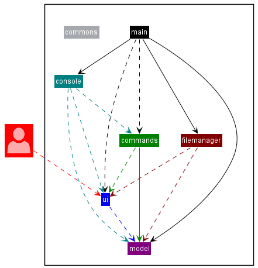

Major components of the app:
* `MTracker` contains the `main` method responsible for launching and 
running the app. It first initializes the required components
  and executes the overall program.
* `ui` holds the `TextUi` class, which is responsible for displaying various greetings, 
instructions for user input, and other display texts. The class contains both
  strings of commonly used display texts like the console input prompter, and 
  methods that print these strings out, thus ensuring satisfactory user interface and 
  communication with user.
* `console` is a collection of closely-related parser classes that take in the user input, analyse them 
to understand the various commands the user would like to execute through the console.
* `commands` is another collection of closely-related classes that deal with 
executing particular commands determined by the necessary parser classes in console.
* `model` contains two types of classes:
    * `InstrumentManager` singleton class that manages access to the arraylist containing
    all the instruments created by user during the session.
    * `subinstrument` is a collection of the different instrument classes: `Crypto`, 
    `Etf`, `Forex`, and `Stock`. The primary role of these classes is to initialize instrument
      objects of their said type containing their necessary financial information recorded from the user.
* `filemanager` is responsible for saving the session's instruments data to local file, updating
them during runtime, and restoring data from previous session when the program is relaunched.
* `commons` contains classes which are utilised by the other components to execute their functionality:
  * The `Validate` class is responsible for doing various checks on the user inputs and the file data.
  * The `error` package contains different exception classes that displays user specific error messages to guide the 
  user in the usage of the program.

The subsequent sections will elaborate on the more technical design and implementation details of
the architectural components briefly explained in this section.

### Parser component

The main parent class in `console` package is the `InputParser` class which is defined in `InputParser.java`.
The figure below represents the class diagram of how all the parser classes interact with classes outside the `console`
package:

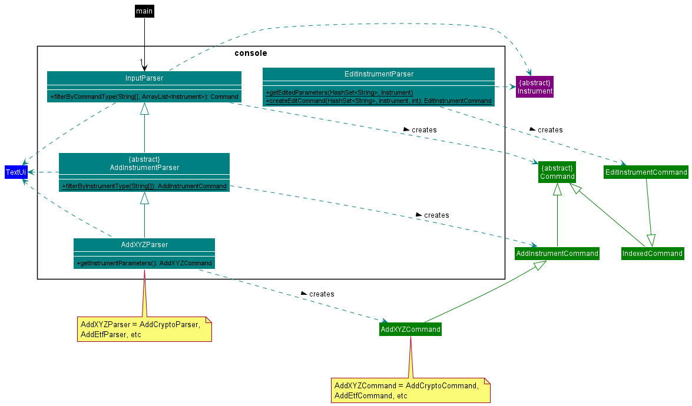

How the `InputParser` class works:
1. When the user enters a command along with the relevant parameters if any, the
   `getCommandComponents()` method in `InputParser` separates the user's command by spaces to return a string array.
2. The command is then determined by using the `filterByCommandType()` method which would return the corresponding
   command type. Examples of different command types are `AddInstrumentCommand`, `DeleteCommand`, `ListCommand` etc.

#### Design considerations for parsing inputs for add functionality 
Given the different types of financial instruments supported by mTracker, an abstract class `AddInstrumentParser`
which inherits from `InputParser` is implemented. Multiple `AddXYZParser` (`XYZ` is
a placeholder for the different instrument types, for example `AddStockParser`) child classes of
`AddInstrumentParser` support the parsing of different instruments and their parameters.
This implementation provides greater extensibility to the add functionality to support more instrument types.

Two alternatives to get the instrument information from the user were considered. The first alternative was to
get the user to add in all the information in a single line with separators
(for example: `stock TSLA; 909.68; negative; To buy`). This was not implemented as it is likely
for the user to enter the parameters in the wrong order. This becomes especially problematic if there are multiple
parameters that require the same type to represent different attributes of the instrument (for example: The entry and
exit price attributes in Forex instrument).

The second alternative was to get the user to indicate which attribute the parameter would belong to
(for example: `stock n/TSLA p/909.68 s/negative r/To buy`). This way there are distinct markers to define which
parameter belongs to which attribute. However, this was not implemented as given that some instruments have as many as
7 different attributes, it requires the user to recall all the attributes needed to add an instrument which is not
user-friendly.

Therefore, the current implementation prompts the user on the information required to add a particular instrument.
This helps to support the user through the process of adding a new instrument.

#### Design considerations for parsing inputs for edit functionality
Despite currently supporting 4 types of financial instruments, the parsing of inputs for the edit functionality does not require
4 edit classes for each instrument. This is because the edit functionality is done on an existing instrument which
contains information on what parameters can be edited on. Therefore, only a single EditInstrumentParser 
is needed to filter out all the other parameters that are irrelevant to the instrument.
 
In addition, the current design is able to parse multiple input parameters and display the relevant instructions to
users in editing those parameters for a particular instrument. This allows the user to edit multiple parameters of a
instrument at once which increases its user-friendliness.

### Model Component


The `model` package contains the `InstrumentManager` class and `Instrument` class. It is defined
in `InstrumentManager.java` and `Instrument.java` respectively. This figure below represents the class diagram of 
how the different class work together:

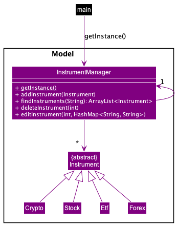

The `Model` component:

* Stores the instrument data through `Instrument` objects which are contained and managed by the `InstrumentManager`
* Contains an abstract parent `Instrument` class. The 4 child sub-instrument classes `Crypto`, `Etf`, `Forex` and 
`Stock` implements the Overridden methods (e.g. `textFileFormatting()`).
* Contains the `InstrumentManager` class which manages the list of instruments (e.g. add a new instrument to 
the list). `InstrumentManager` is implemented as a singleton class to ensure that only one instrument list exists.
This ensures the user only edits one list and prevents possible data corruption (e.g. adding a new instrument to 
different lists).
* Does not have any dependencies on any of the other components, as the `Model` component is meant to be responsible
solely for the data representation and modification of instruments.

  
### Ui

The ui component only contains the TextUi.java file and its API can be found
[here](https://github.com/AY2122S1-CS2113T-T12-1/tp/blob/master/src/main/java/seedu/mtracker/ui/TextUi.java).

It is a basic java class containing string attributes and helper methods for displaying the different features, texts and
instructions to the user. Hence, **under the single-responsibility principle (SRP), its only responsibility is to act as the primary interaction platform
between the user and the rest of the program**.

As detailed by the UML diagrams in the Architecture sections above, **many other parser and command classes utilize
the methods contained in `TextUi`** to display instructions on the console for required user input. Hence, **most other
classes of this program are dependent on the methods of this `TextUi` class** for their proper interaction with the user.

Thus, the **`TextUi` class is highly-cohesive** as it contains all the user text display methods for the various classes
in itself. This **enhances maintainability** as only this class **has to be modified to achieve a small change in
the desired texted or instruction to be displayed by various classes**, and **increases reusability of the module**
as all aspects of texts or instruments to be displayed on the console **have been localized**.

On the other hand, the `TextUi` class itself **has a dependency only on an Instrument class** whenever 
the user wishes to `list` out all the instruments in the watchlist or if s/he wants to `view`
one such instrument in detail. The following sequence diagram explains `TextUi`'s interaction with an `Instrument` class when 
ListCommand.execute() calls the `displayInstrument()` method when the user wishes to list out all instruments in the watchlist:

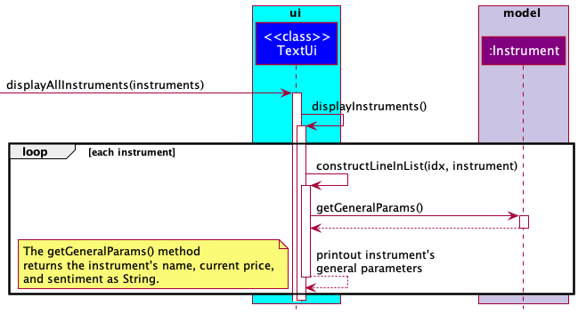

Hence, in this scenario, `TextUi` relies on the particular `Instrument` class's `getGeneralParams()` method to retrieve
all the general financial information recorded for that instrument like the instrument's name,
current price, and sentiment. Through this sequence process, `TextUi` displays this information in an appropriate format to
the user.

A similar approach is also taken when the user wishes to `view` a particular instrument. However,
instead of a loop being iterated over in the `displayInstruments()` method, the `getAllParams()` method is called instead
which fetches all the financial information of that particular instrument back to `TextUi` for display:

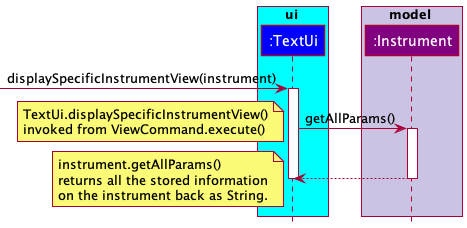

### Command Component


The Command component contains all the commands classes, where its respective class is instantiated when a valid command is entered by the user. 

Some of the key command classes include:
```
1) AddCrytoCommand
2) AddEtfCommand
3) AddForexCommand
3) AddStockCommand
4) DeleteCommand
5) DoneCommand
6) EditInstrumentCommand
7) FindCommand
6) ListCommand
7) ViewCommand
8) InvalidCommand
9) ExitCommand
```
This figure below shows the class diagram of all the commands classes:
<>

Command component:

* Each command class is responsible in carrying out its respective function where each command will execute different actions on the model component. In addition they ensure that the user sees the correct messages based on their input.
* All Command classes have a method `execute()` that does the actions required according to the user's input.
* Contains an abstract parent `Command` class. All commands are child classes of the Command class.
* Contains a parent `AddInstrumentCommand` class where all commands related to adding an instrument inherits from.
* Other than ExitCommand and InvalidCommand, the other command classes are dependent of on the InstrumentManager in order to execute the required actions on the stored instruments.
* The command classes are dependent on the `TextUi` class. This allows the command class to display its execution results to the user.


The figure below represents the sequence diagram when the user executes a done command. In this scenario the user
gave the command "done 1". Here "done" is the command keyword and "1" represents the current position of the instrument 
in the list of instruments:

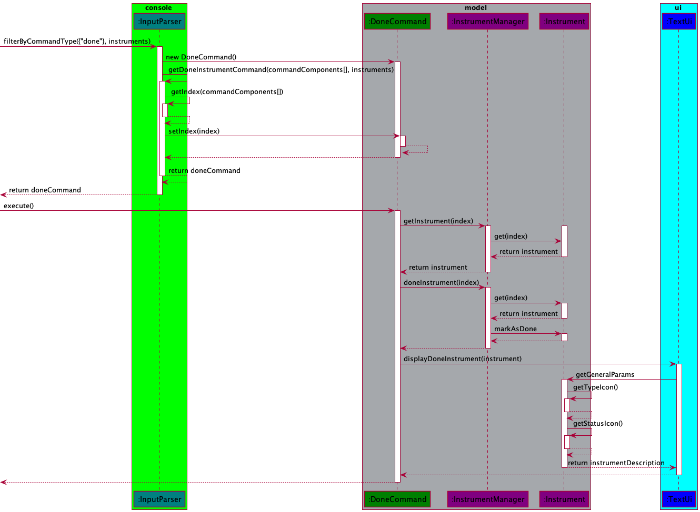

More details about the reference frame for executing the done command is shown below:

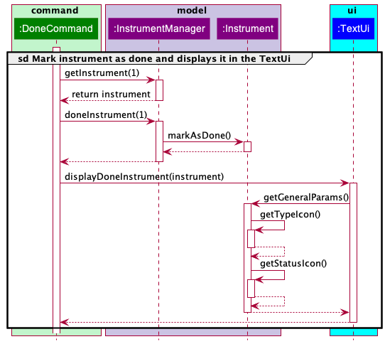

### FileManager Component
The `filemanager` package contains the `Storage`, `InstrumentEncoder` and `InstrumentDecoder` classes. It is defined in
the `Storage.java`, `InstrumentEncoder.java` and `InstrumentDecoder.java` respectively. This figure below represents the class diagram of
how the different class work together:

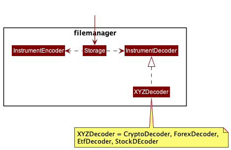

The FileManager Component:

* Contains the `Storage` class that loads data from any pre-existing text file. If the file does not exist, it creates 
a new text file to store the data. It updates the file by calling the `writeFile()` method in the `InstrumentEncoder` class.
* Contains the `InstrumentEncoder` class which encodes the instrument data into a text file format for decoding.
* Contains the `InstrumentDecoder` parent class which decodes the text file. The 4 sub-decoder classes `CryptoDecoder`,
`EtfDecoder`, `ForexDecoder` and `StockDecoder` adds the respective instruments with their decoded attributes into the
`InstrumentManager` enabling the program to load pre-existing data.
* Has some dependencies on the `Model` component as it saves and retrieves data from `Model` objects.

#### Design considerations for decoding functionality
Given the different types of financial instruments supported by mTracker, the `InstrumentDecoder` class is implemented. 
Multiple `XYZDecoder` (`XYZ` is a placeholder for the different instrument types, for example `EtfDecoder`) child classes of
`InstrumentDecoder` support the decoding of different instruments and their parameters.
This implementation provides greater extensibility and code re-usability to the decoding functionality to support more 
instrument types. Greater cohesion is achieved by separating the classes to give more focus on each instrument type and
a higher level of abstraction.

## Implementation

### Add instrument feature
The add instrument functionality is mainly handled by the `parser` and `commands` components. Within the `parser`
component, the `InputParser` class implements the method `InputParser#getAddInstrumentParameters()`. This method calls
`AddInstrumentParser#filterByInstrumentType()` which will then guide the user through the process of adding a new
instrument. 

The figure below represents the sequence diagram when the user wants to add a stock:

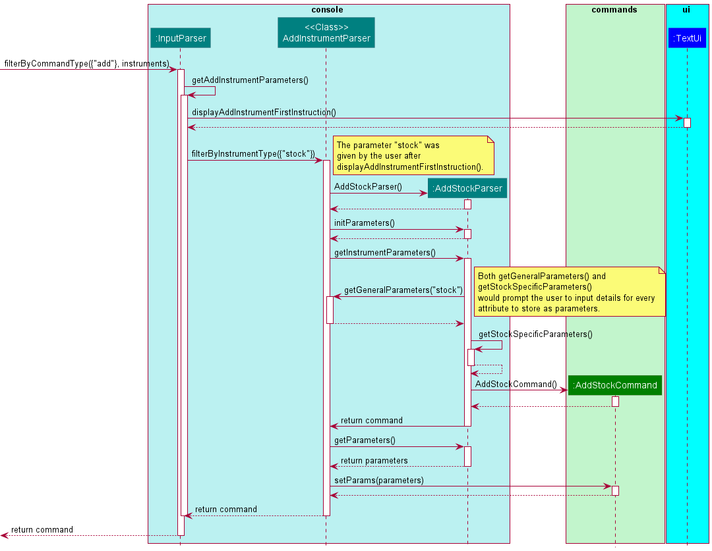

More details about the reference frame for obtaining the stock details and creating the AddStockCommand object are shown
below.

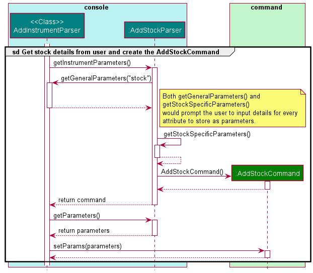

The process for adding the other instruments follow a similar process to the sequence above. The main difference would
be the type of instrument parser called, the parameters collected from the user and the command type returned. For
example instead of calling `AddStockParser#getStockSpecificParameters()`, its equivalent for adding a crypto is 
`AddCryptoParser#getCryptoSpecificParameters()`.

From the notes in the sequence diagram above, for every attribute in the instrument, there would be an instructional
prompt to get user to provide information for that attribute. This is done through a series of methods in
the `TextUi` class.

### Loading pre-existing data
The loading of pre-existing data is mainly handled by the `filemanager` and `model` components. The main method calls 
`Storage#loadFileData(instrumentManager)` which uses `InstrumentDecoder#readFile(instrumentManager, fileData)`. This method calls 
`InstrumentDecoder#addSavedInstrumentToList(instrumentManager, textSegment)` for each pre-existing instrument which will add the 
corresponding instrument in the `InstrumentManager` through calling the `XYZDecoder#addXYZToList(textSegment, instrumentManager)`. 
In the event the instrument is not one of the 4 types of instruments, the `InstrumentDecoder` will throw a new `InvalidInstrumentInFileError`
and display the corresponding error message.

The figures below represents the sequence diagrams when the user loads a pre-existing crypto:

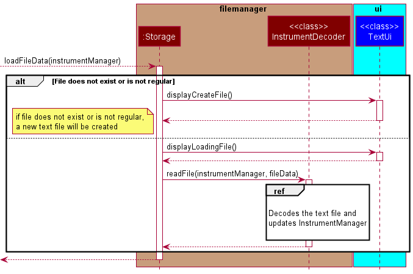

More details about the reference frame for decoding and updating the `InstrumentManager` is shown below:

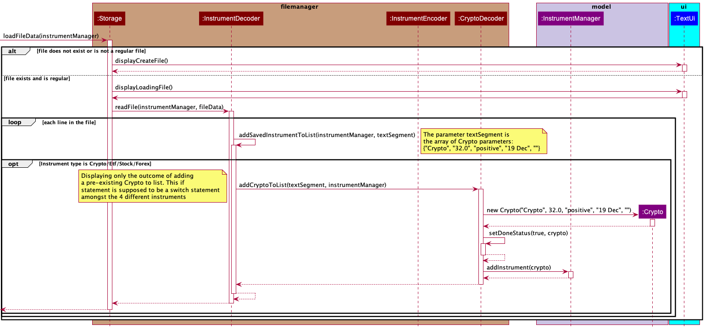

More details about the reference frame for adding the decoded instrument into the `InstrumentManager` is shown below:

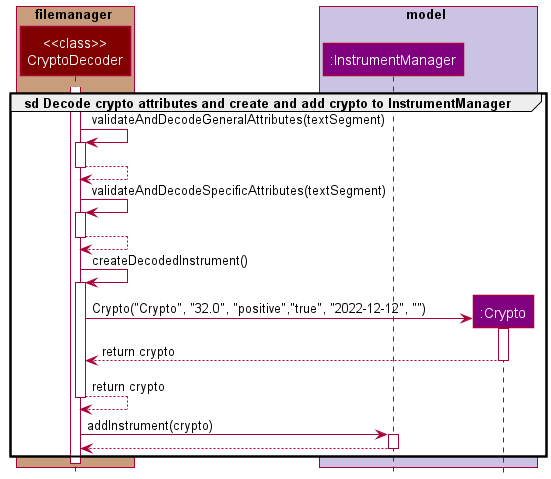

The process for loading other pre-existing instruments follow a similar process to the sequence above. The main difference
would be the type of instrument decoder called, the different instrument specific decoded parameters and the type of instrument
added to the `InstrumentManager`. For example when loading a stock instead of calling `CryptoDecoder#addCryptoToList(textSegment, instrumentManager)`
it will call `StockDecoder#addStockToList(textSegement, instrumentManager)`.

If loading the file data has any error, it will throw the corresponding file error. This file error will display the
appropriate message through the `TextUi` class.

### Storing current data
The storing of current data is mainly handled by the `filemanager` and `model` components. The main method calls
the `Storage#updateFileData(instruments)` which implements the `InstrumentEncoder#writeFile(instruments, writeToFile)` method. 
This method calls the `Instrument#textFileFormatting()` method for every instrument that is being stored. The formatted 
instrument details are then written to the `MTracker` text file.

The figure below represents the sequence diagram when the user stores current data:


If storing the file data has any error, it will throw the corresponding file error. This file error will display the
appropriate message through the `TextUi` class.

## Product scope
### Target user profile

{Describe the target user profile}

### Value proposition

{Describe the value proposition: what problem does it solve?}

## User Stories

|Version| As a ... | I want to ... | So that I can ...|
|--------|----------|---------------|------------------|
|v1.0|new user|see usage instructions|refer to them when I forget how to use the application|
|v2.0|user|find a to-do item by name|locate a to-do without having to go through the entire list|

## Non-Functional Requirements

1. The program should work on operating systems with `Java 11` installed.
2. 

## Glossary

* *glossary item* - Definition

## Instructions for manual testing

{Give instructions on how to do a manual product testing e.g., how to load sample data to be used for testing}
